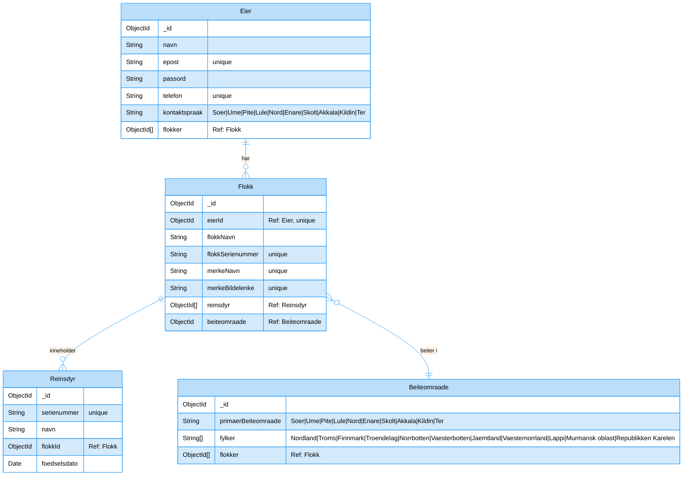
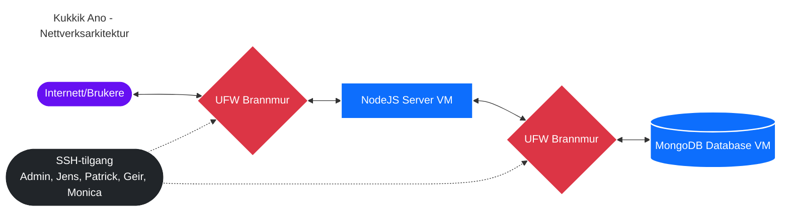

# Her er dokumentasjonen

## Tech Stack

| Teknologi | Kategori | Beskrivelse |
|-----------|----------|-------------|
| Node.js | Backend | JavaScript-runtime |
| Express.js | Backend | Webserver framework for håndtering av ruter og middleware |
| MongoDB | Database | NoSQL-database for lagring av data |
| Mongoose | Database | MongoDB ORM for Node.js, forenkler databaseoperasjoner |
| Express-session | Sikkerhet | Sesjonshåndtering for brukerautentisering |
| Connect-mongo | Sikkerhet | MongoDB sesjonslagring for Express-session |
| Bcrypt | Sikkerhet | Passordkrypteringsbibliotek for sikker brukerautentisering |
| EJS | Frontend | Template-engine for serverside-rendering |
| Dotenv | Verktøy | Håndtering av miljøvariabler |
| Helmet | Sikkerhet | Samling av sikkerhetsmiddleware for Express-applikasjoner |
| CORS | Sikkerhet | Cross-Origin Sikkerhetsmiddleware |
| PM2 | DevOps | Process-handler for Node.js-applikasjoner i produksjon |
| Nginx | DevOps | Webserver og omvendt proxy |
| UFW | DevOps | Brannmur for serversikkerhet |
| SSH | DevOps | Remote tilgang til server |

## ER Diagram:

## Nettverkskart

