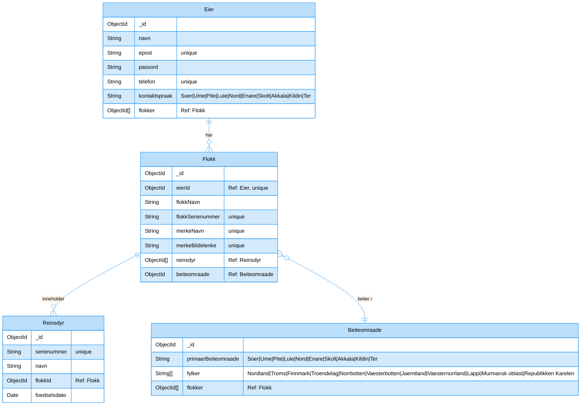

# Her er dokumentasjonen

## Tech Stack

| Teknologi | Kategori | Beskrivelse |
|-----------|----------|-------------|
| Node.js | Backend | JavaScript-kjøretidsmiljø for serversideeksekvering |
| Express.js | Backend | Webapplikasjonsrammeverk for håndtering av ruter og middleware |
| MongoDB | Database | NoSQL-database for lagring av reinsdyr- og brukerdata |
| Mongoose | Database | MongoDB objektmodelleringsverktøy for Node.js, forenkler databaseoperasjoner |
| Express-session | Sikkerhet | Sesjonshåndtering for brukerautentisering |
| Connect-mongo | Sikkerhet | MongoDB sesjonslagring for Express-session |
| Bcrypt | Sikkerhet | Passordkrypteringsbibliotek for sikker brukerautentisering |
| EJS | Frontend | Mal-motor for serverside-rendering |
| Dotenv | Verktøy | Håndtering av miljøvariabler |
| PM2 | DevOps | Prosesshåndterer for Node.js-applikasjoner i produksjon |
| Nginx | DevOps | Webserver og omvendt proxy |
| UFW | DevOps | Ukomplisert brannmur for serversikkerhet |
| SSH | DevOps | Secure Shell for ekstern servertilgang |
| Helmet | Sikkerhet | Samling av sikkerhetsmiddleware for Express-applikasjoner |

## ER Diagram:

