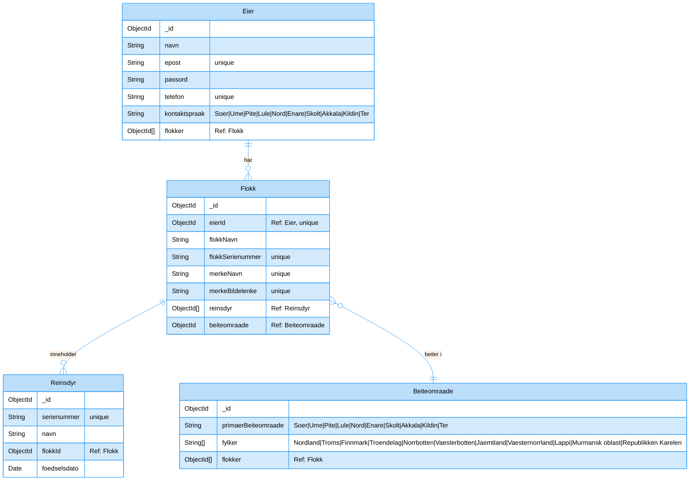

# Her er dokumentasjonen

## Tech Stack

| Teknologi | Kategori | Beskrivelse |
|-----------|----------|-------------|
| Node.js | Backend | JavaScript-runtime |
| Express.js | Backend | Webserver framework for håndtering av ruter og middleware |
| MongoDB | Database | NoSQL-database for lagring av data |
| Mongoose | Database | MongoDB ORM for Node.js, forenkler databaseoperasjoner |
| Express-session | Sikkerhet | Sesjonshåndtering for brukerautentisering |
| Connect-mongo | Sikkerhet | MongoDB sesjonslagring for Express-session |
| Bcrypt | Sikkerhet | Passordkrypteringsbibliotek for sikker brukerautentisering |
| EJS | Frontend | Template-engine for serverside-rendering |
| Dotenv | Verktøy | Håndtering av miljøvariabler |
| Helmet | Sikkerhet | Samling av sikkerhetsmiddleware for Express-applikasjoner |
| CORS | Sikkerhet | Cross-Origin Sikkerhetsmiddleware |
| PM2 | DevOps | Process-handler for Node.js-applikasjoner i produksjon |
| Nginx | DevOps | Webserver og omvendt proxy |
| UFW | DevOps | Brannmur for serversikkerhet |
| SSH | DevOps | Remote tilgang til server |

## ER Diagram:



## Nettverkskart


## API Documentation

### Authentication

All API routes that require authentication use Express session middleware. Authentication status is determined by `req.session.userId`.

#### Authentication Endpoints

| Endpoint | Method | Description | Request Body | Response |
|----------|--------|-------------|--------------|----------|
| `/auth/register` | POST | Register a new user | `{ navn, epost, passord, telefon, kontaktspråk }` | `{ success: boolean, message: string, user: object }` |
| `/auth/login` | POST | Log in an existing user | `{ epost, passord }` | `{ success: boolean, message: string, user: object }` |
| `/auth/logout` | POST | Log out the current user | None | `{ success: boolean, message: string }` |

### Flokk (Herd) Management

#### Flokk Endpoints

| Endpoint | Method | Description | Request Body | Response |
|----------|--------|-------------|--------------|----------|
| `/flokk/registerFlokk` | POST | Register a new herd | `{ flokkNavn, merkeNavn, beiteomraade, flokkSerienummer, merkeBildelenke }` and file upload | `{ success: boolean, message: string, flokk: object }` |
| `/flokk/getFlokk/:id` | GET | Get details of a specific herd | None | `{ success: boolean, message: string, flokk: object, reinsdyr: array, pagination: object }` |

### Reinsdyr (Reindeer) Management

#### Reinsdyr Endpoints

| Endpoint | Method | Description | Request Body | Response |
|----------|--------|-------------|--------------|----------|
| `/reinsdyr/registerRein` | POST | Register a new reindeer | `{ navn, flokkId, fødselsdato, customSerienummer }` | `{ success: boolean, message: string, reinsdyr: object }` |
| `/reinsdyr/transferRein` | POST | Transfer a reindeer between herds of the same owner | `{ reinsdyrId, targetFlokkId }` | `{ success: boolean, message: string, reinsdyr: object }` |

### Transaction System (Reindeer Transfer Between Owners)

#### Transaction Endpoints

| Endpoint | Method | Description | Request Body | Response |
|----------|--------|-------------|--------------|----------|
| `/reinsdyr/initiateTransfer` | POST | Initiate a transfer request | `{ reinsdyrId, tilEierEpost, melding }` | `{ success: boolean, message: string, transaksjon: object }` |
| `/reinsdyr/respondTransfer` | POST | Respond to a transfer request | `{ transaksjonId, godkjent, tilFlokkId, melding }` | `{ success: boolean, message: string, transaksjon: object }` |
| `/reinsdyr/confirmTransfer` | POST | Confirm a transfer (final step) | `{ transaksjonId, godkjent }` | `{ success: boolean, message: string, transaksjon: object }` |
| `/reinsdyr/transactions` | GET | Get all transactions for the current user | Query params: `type, status` | `{ success: boolean, transaksjoner: array, gruppertTransaksjoner: object, totaltAntall: number }` |

### Search Functionality

#### Search Endpoint

| Endpoint | Method | Description | Query Params | Response |
|----------|--------|-------------|--------------|----------|
| `/search` | GET | Search across owners, herds, and reindeer | `q` (search query) | `{ success: boolean, message: string, results: object, totalCount: number }` |

## Usage Guide

### Setup and Installation

1. **Clone the repository**

```bash
git clone https://github.com/EliasNeerbye/Reinsdyr-Broker-ProveProveEksamen.git
cd Reinsdyr-Broker-ProveProveEksamen/server
```

2. **Install dependencies**

```bash
npm install
```

3. **Configure environment variables**

Create a `.env` file in the server directory with the following variables:

```
MONGO_USER = username
MONGO_PWD = password
MONGO_IP = 127.0.0.1:27017

SALT_ROUNDS = 10
PROD_TRUE = false
SESSION_SECRET = "your-secret-key"
PORT = 3000

APP_IP = localhost
SSL_STATE = http
```

4. **Initialize the database with mock data (optional)**

```bash
node mockData.js
```

5. **Start the application**

```bash
node app.js
```

For production, it's recommended to use PM2:

```bash
npm install -g pm2
pm2 start app.js --name reinsdyr-broker
```

### Basic Usage Flow

#### User Registration and Authentication

1. **Register a new user**

```javascript
const registerUser = async () => {
  const response = await fetch("/auth/register", {
    method: "POST",
    headers: { "Content-Type": "application/json" },
    body: JSON.stringify({
      navn: "User Name",
      epost: "user@example.com",
      passord: "password123",
      telefon: "+47 123 45 678",
      kontaktspråk: "Nord"
    }),
    credentials: "include"
  });
  return await response.json();
};
```

2. **Login**

```javascript
const login = async () => {
  const response = await fetch("/auth/login", {
    method: "POST",
    headers: { "Content-Type": "application/json" },
    body: JSON.stringify({
      epost: "user@example.com",
      passord: "password123"
    }),
    credentials: "include"
  });
  return await response.json();
};
```

#### Managing Herds (Flokk)

1. **Register a new herd**

```javascript
const registerFlokk = async () => {
  const formData = new FormData();
  formData.append("flokkNavn", "My Herd");
  formData.append("merkeNavn", "Unique Mark");
  formData.append("beiteomraade", "Nord");
  // Optionally add a custom serienummer
  formData.append("flokkSerienummer", "F-12345678");
  // Either upload an image or provide a URL
  formData.append("merkeBilde", fileInput.files[0]);
  // OR
  formData.append("merkeBildelenke", "https://example.com/image.jpg");
  
  const response = await fetch("/flokk/registerFlokk", {
    method: "POST",
    body: formData,
    credentials: "include"
  });
  return await response.json();
};
```

2. **Get herd details with pagination**

```javascript
const getFlokkDetails = async (flokkId, page = 1, limit = 10) => {
  const response = await fetch(`/flokk/getFlokk/${flokkId}?page=${page}&limit=${limit}`, {
    method: "GET",
    headers: { "Content-Type": "application/json" },
    credentials: "include"
  });
  return await response.json();
};
```

#### Managing Reindeer (Reinsdyr)

1. **Register a new reindeer**

```javascript
const registerReinsdyr = async () => {
  const response = await fetch("/reinsdyr/registerRein", {
    method: "POST",
    headers: { "Content-Type": "application/json" },
    body: JSON.stringify({
      navn: "Rudolf",
      flokkId: "flokkId123",
      fødselsdato: "2020-01-01",
      // Optional custom serienummer
      customSerienummer: "R-12345678"
    }),
    credentials: "include"
  });
  return await response.json();
};
```

2. **Transfer a reindeer between your own herds**

```javascript
const transferReinsdyr = async () => {
  const response = await fetch("/reinsdyr/transferRein", {
    method: "POST",
    headers: { "Content-Type": "application/json" },
    body: JSON.stringify({
      reinsdyrId: "reinsdyrId123",
      targetFlokkId: "targetFlokkId456"
    }),
    credentials: "include"
  });
  return await response.json();
};
```

#### Transaction System (Transferring Reindeer Between Owners)

1. **Initiate a transfer**

```javascript
const initiateTransfer = async () => {
  const response = await fetch("/reinsdyr/initiateTransfer", {
    method: "POST",
    headers: { "Content-Type": "application/json" },
    body: JSON.stringify({
      reinsdyrId: "reinsdyrId123",
      tilEierEpost: "neweier@example.com",
      melding: "I'd like to transfer this reindeer to you."
    }),
    credentials: "include"
  });
  return await response.json();
};
```

2. **Respond to a transfer request (as recipient)**

```javascript
const respondToTransfer = async () => {
  const response = await fetch("/reinsdyr/respondTransfer", {
    method: "POST",
    headers: { "Content-Type": "application/json" },
    body: JSON.stringify({
      transaksjonId: "transactionId123",
      godkjent: true, // true to accept, false to decline
      tilFlokkId: "myFlokkId456", // required if godkjent is true
      melding: "Thank you, I accept this transfer."
    }),
    credentials: "include"
  });
  return await response.json();
};
```

3. **Confirm a transfer (final step by original owner)**

```javascript
const confirmTransfer = async () => {
  const response = await fetch("/reinsdyr/confirmTransfer", {
    method: "POST",
    headers: { "Content-Type": "application/json" },
    body: JSON.stringify({
      transaksjonId: "transactionId123",
      godkjent: true // true to complete the transfer, false to cancel
    }),
    credentials: "include"
  });
  return await response.json();
};
```

4. **Get all transactions**

```javascript
const getTransactions = async (type = "all", status = "") => {
  const response = await fetch(`/reinsdyr/transactions?type=${type}&status=${status}`, {
    method: "GET",
    headers: { "Content-Type": "application/json" },
    credentials: "include"
  });
  return await response.json();
};
```

#### Search Functionality

```javascript
const searchSystem = async (query) => {
  if (query.length < 3) return; // Minimum 3 characters required
  
  const response = await fetch(`/search?q=${encodeURIComponent(query)}`, {
    method: "GET",
    headers: { "Content-Type": "application/json" },
    credentials: "include"
  });
  return await response.json();
};
```

### Server Deployment

For deploying to a new server, you can use the provided `setupVM.sh` script:

```bash
curl https://raw.githubusercontent.com/EliasNeerbye/Reinsdyr-Broker-ProveProveEksamen/refs/heads/main/setupVM.sh | bash
```

This script will:
1. Install nvm and Node.js
2. Clone the repository
3. Install dependencies
4. Set up PM2 for process management
5. Configure nginx as a reverse proxy
6. Create a `.env` file with appropriate settings

### Database Schema

The application uses MongoDB with the following main collections:

1. **Eier** (Owner)
   - Information about reindeer owners
   - Contact details and language preferences

2. **Flokk** (Herd)
   - Groups of reindeer belonging to an owner
   - Associated with a specific grazing area

3. **Reinsdyr** (Reindeer)
   - Individual reindeer records
   - Belongs to a specific herd

4. **Beiteområde** (Grazing Area)
   - Geographic areas organized by Sami language regions
   - Contains counties and linked herds

5. **Transaksjon** (Transaction)
   - Records of reindeer transfers between owners
   - Multi-step approval process with status tracking

### Security Considerations

1. **Authentication**: The system uses bcrypt for password hashing and Express-session for session management.

2. **Authorization**: Middleware checks ensure users can only access and modify their own data.

3. **Input Validation**: All user inputs are validated using Validator.js.

4. **File Uploads**: File uploads are restricted by type and size to prevent abuse.

5. **Environmental Variables**: Sensitive configuration is stored in environment variables.

6. **CORS Protection**: The application implements CORS protection to control access from external domains.